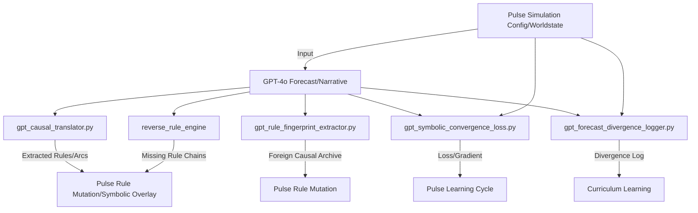

# Plan: Integrating GPT-4o as an Epistemic Mirror for Simulation Bootstrapping

## Overview

The goal is to use GPT-4o not just as a prediction engine, but as an epistemic agent that can:
- Reveal implicit causal logic, symbolic arcs, and missing domains.
- Distill and archive "foreign" causal fingerprints.
- Quantify and minimize symbolic divergence between Pulse and GPT.
- Enable reflexive self-repair and curriculum learning based on symbolic divergence, not just output accuracy.

## Key Modules & Modifications

### 1. `gpt_causal_translator.py`
- **Purpose:** Extracts rules, symbolic arcs, and missing domains from GPT outputs.
- **Inputs:** GPT narrative outputs, Pulse simulation configs/worldstates.
- **Outputs:** 
  - Extracted (condition → consequence) rules.
  - Symbolic arc labels.
  - List of missing domains/variables.
- **Integration:** Called after GPT forecast generation; outputs feed into rule mutation and symbolic overlays.

### 2. `gpt_rule_fingerprint_extractor.py`
- **Purpose:** Distills causal fingerprints from GPT rationales.
- **Inputs:** GPT rationales/explanations for predictions.
- **Outputs:** 
  - Matched/unmatched rule fingerprints.
  - "Foreign causal archive" for unmatched fingerprints.
- **Integration:** Periodically triggers Pulse rule mutation to absorb new logics.

### 3. `gpt_symbolic_convergence_loss.py`
- **Purpose:** Computes symbolic divergence (loss) between Pulse and GPT.
- **Inputs:** Symbolic tags, capital outcomes, rule traces, trust deltas from both systems.
- **Outputs:** Scalar loss value, gradient for learning.
- **Integration:** Used as a loss function in Pulse learning cycles.

### 4. `gpt_forecast_divergence_logger.py`
- **Purpose:** Logs and tags types of divergence between Pulse and GPT.
- **Inputs:** Pulse and GPT outputs, symbolic traces.
- **Outputs:** 
  - Divergence logs with tags: strategic, narrative inconsistency, variable disagreement.
- **Integration:** Used for curriculum learning and model diagnostics.

### 5. Causal Reconstruction via `reverse_rule_engine`
- **Purpose:** Simulates which rule chains in Pulse would explain GPT’s predictions.
- **Inputs:** GPT symbolic predictions, Pulse rule base.
- **Outputs:** 
  - List of missing or divergent rule chains.
- **Integration:** Guides rule mutation and symbolic alignment.

---

## Data Flow & Integration Diagram

---

## Implementation Steps

1. **Develop `gpt_causal_translator.py`:**
   - Parse GPT outputs for explicit/implicit rules, symbolic arcs, and missing domains.
   - Output structured data for downstream use.

2. **Develop `gpt_rule_fingerprint_extractor.py`:**
   - Extract and archive unmatched causal fingerprints from GPT rationales.
   - Tag and store for periodic rule mutation.

3. **Develop `gpt_symbolic_convergence_loss.py`:**
   - Define symbolic loss function (Δ(symbolic_tag) + Δ(capital_outcome) + Δ(rule_trace) + trust_penalty).
   - Integrate into Pulse learning cycles.

4. **Develop `gpt_forecast_divergence_logger.py`:**
   - Log and tag divergences between Pulse and GPT.
   - Support curriculum learning and diagnostics.

5. **Integrate with `reverse_rule_engine`:**
   - Use for causal reconstruction and alignment.

6. **Update simulation/learning pipelines:**
   - Insert GPT mirroring steps at appropriate points (e.g., after forecast generation, during learning cycles).

---

## Benefits Unlocked

| Capability                          | Benefit                                                      |
|--------------------------------------|--------------------------------------------------------------|
| Symbolic alignment via causal backprop | Pulse evolves by reconstructing GPT’s meaning                |
| Epistemic convergence tracking         | Track worldview divergence, not just output difference       |
| Statistical-symbolic hybrid learning  | Forecasts learned through alignment loss, not binary accuracy|
| Reflexive self-repair                 | Pulse repairs itself based on symbolic mismatch, not just failure |