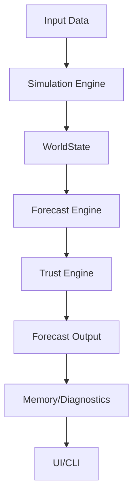

# Pulse

**Version:** v0.3.7 – AWS Batch Integration
---
## 📝 Patch Notes (v0.3.6) — 2025-05-02
- **Streaming Data Loading Optimization:**
  - Implemented `StreamingDataStore` with streaming data processing and memory-efficient progressive loading.
  - Enhanced columnar data format usage with Arrow/Parquet integration.
  - Added intelligent data prefetching and automatic fallbacks.
  - Integrated `StreamingDataStore` with `ParallelTrainingCoordinator` for seamless usage.
  - Created comprehensive tests and documentation.

## 📝 Patch Notes (v0.3.7) — 2025-05-02
- **AWS Batch Integration:**
  - Implemented AWS Batch infrastructure for retrodiction training POC.
  - Created Terraform configuration for AWS Batch, S3, and VPC.
  - Implemented AWS Batch job submission and orchestration scripts (`aws_batch_submit.py`, `aws_batch_submit_status.py`).
  - Containerized Pulse retrodiction training components for AWS Batch execution.
  - Added comprehensive documentation in `AWS_BATCH_INTEGRATION.md` and README.md.
## 📝 Patch Notes (v0.3.5) — 2025-05-02
- **Dask Local Cluster Integration:**
  - Implemented Dask LocalCluster for distributed computing in the ParallelTrainingCoordinator
  - Enhanced parallel execution with dynamic task scheduling and work stealing for better resource utilization
  - Added integrated diagnostics and visualization through the Dask dashboard
  - Maintained backward compatibility with existing parallel execution logic
  - Improved error handling and task cancellation capabilities
  - Added configuration options for scheduler and dashboard ports

## 📝 Patch Notes (v0.3.4) — 2025-05-02
- **Trust Tracker & Metrics Optimization:**
  - Implemented `AsyncMetricsCollector` with background thread processing to prevent I/O operations from blocking the training loop
  - Created `TrustUpdateBuffer` for efficiently batching, aggregating, and processing trust updates
  - Enhanced `ParallelTrainingCoordinator` with optimized components for improved training throughput
  - Added comprehensive test suites for new optimization components
  - Optimized memory usage with NumPy arrays for intermediate trust computations

## 📝 Patch Notes (v0.3.3) — 2025-05-02
- **Data Loading Optimization:**
  - Implemented `OptimizedDataStore` with vectorized filtering, memory-mapping (HDF5/Parquet), LRU caching, and parallel loading for improved data access performance.
  - Integrated `OptimizedDataStore` into `recursive_training/parallel_trainer.py`.
  - Added comprehensive tests for `OptimizedDataStore`.

## 📝 Patch Notes (v0.3.2) — 2025-05-02
- **Conversational Interface Enhancements:**
  - Integrated OpenAI GPT models (GPT-4 Turbo and GPT-3.5 Turbo) for advanced response generation
  - Added configuration system for API keys, model selection, and cost estimation
  - Implemented GUI settings panel for selecting models and managing API credentials
  - Created robust error handling for API rate limits and service disruptions
  - Added fallback mechanism to maintain functionality when API is unavailable
  - Enhanced RAG system with proper token counting and cost optimization
  - Full documentation in `chatmode/OPENAI_INTEGRATION.md`

## 📝 Patch Notes (v0.3.3) — 2025-05-02
- **Data Loading Optimization:**
  - Implemented `OptimizedDataStore` with vectorized filtering, memory-mapping (HDF5/Parquet), LRU caching, and parallel loading for improved data access performance.
  - Integrated `OptimizedDataStore` into `recursive_training/parallel_trainer.py`.
  - Added comprehensive tests for `OptimizedDataStore`.

## 📝 Patch Notes (v0.3.1) — 2025-05-02
- **Performance Optimizations for Retrodiction Training:**
  - Implemented vectorized operations for 3-10x faster causal discovery
  - Created optimized Bayesian trust tracker with batch operations and caching for 5-15x faster trust updates
  - Developed parallel training framework enabling CPU-proportional speedup
  - Enhanced counterfactual engine with caching and parallel query processing
  - Integrated all optimization components for significantly improved training throughput

## 📝 Patch Notes (v0.3.0) — 2025-04-30

- **Recursive AI Training Implementation:**
  - Implemented hybrid rules approach maintaining compatibility with existing dictionary-based rules
  - Phased implementation strategy:
    - Phase 1: Data Pipeline/Core Metrics
    - Phase 2: Rule Generation
    - Phase 3: Advanced Metrics/Error Handling
  - Added cost control system with token/request limits to prevent unexpected expenses
  - Implemented GPT-Symbolic feedback loop and uncertainty-driven curriculum
  - Added rule review dashboard for monitoring and assessment
  - Enhanced data ingestion to write to file incrementally, ensuring preservation even if interrupted

---
## 📝 Patch Notes (v0.2.x) — 2025-04-30

- **Architectural Refactoring:**  
  - Introduced interface-based architecture for Simulation, Trust, Symbolic, and Core systems.
  - Implemented adapters, a service registry, event bus, and system facades to reduce tight coupling and improve modularity.
  - Refactored TrustEngine and Simulator Core using Single Responsibility, Strategy, and Command patterns for clarity and maintainability.

- **Feature Completion:**  
  - Fully implemented rule-based retrodiction, including the reverse rule engine, rule fingerprinting, and integration with Trust and Symbolic systems.
  - Added comprehensive unit and integration tests for retrodiction.

- **Test Suite Improvements:**  
  - Resolved all previously failing and skipped tests (now 144 passing, 0 failures).
  - Updated retrodiction tests to use new bounded state mutation APIs.
  - Improved handling of optional Graphviz dependency in forecast lineage tests.
  - Addressed 51 deprecation warnings (notably `datetime.utcnow()`), ensuring future compatibility.
  - Fixed "Forecast error: must be real number, not str" in the forecast ensemble module by implementing robust type checking and conversion.

- **Documentation:**  
  - Added detailed documentation for retrodiction and reverse rule engine features.
  - Updated CLI and integration guidelines.
  - Added error handling documentation for the forecast ensemble module.

These changes significantly improve maintainability, testability, and robustness across the Pulse codebase.
---

Pulse is a symbolic-capital foresight simulator that models emotional overlays, strategic fragility, capital exposure forks, and trust-weighted forecast generation.


---

## 🧬 Project Identity

Pulse is a modular simulation intelligence engine designed for recursive forecasting, retrodiction, and capital/narrative strategy synthesis.
It operates by combining emotional-symbolic overlays, trust scoring, and adaptive rule evolution to generate and validate optimal timelines.  
It's goal is to ingest real-time market, social, political, ecological, etc. data, run monte carlo simulations, state retrodiction, forecast retrodiction, etc. to generate confidence on probabilistic outcomes. 
Memory and trace persistence are core: all simulation cycles are scored, pruned, and iteratively improved.

---


---

## 🚀 Quickstart

    cd pulse
    python main.py

- Outputs 5 forecast cycles by default
- Prints Strategos Digest grouped by trust level
- Saves optional `digest.txt` if logging is enabled

## ⚙️ Verbs

All output is emitted as JSON.

- **forecast**: Run forecast cycle  
  Example:
  ```bash
  pulse forecast --start-year 2025 --turns 10
  # => {"result": {...}}
  ```

- **compress**: Compress forecasts  
  Example:
  ```bash
  pulse compress --input-file forecasts.json --output-file compressed.json
  # => {"result": {...}}
  ```

- **retrodict**: Run retrodiction cycle  
  Example:
  ```bash
  pulse retrodict --start-date 2017-01-01 --days 30
  # => {"result": {...}}
  ```

- **train-gpt**: Run GPT training cycle  
  Example:
  ```bash
  pulse train-gpt --dataset-path data/train.json --epochs 5
  # => {"result": {...}}
  ```

- **status**: Generate status report  
  Example:
  ```bash
  pulse status
  # => {"result": {...}}
  ```

- **exit**: Exit the shell  
  Example:
  ```bash
  pulse exit
  # (shell exits)
  ```
---

## 🆕 Strategos Digest CLI & Live UI

- **CLI:**  
  Build a digest from compressed forecasts or prompt filter:
  ```
  python -m forecast_output.strategos_digest_builder --from-prompt "AI" --export markdown --output digest.md
  ```
  Use digest templates:
  ```
  python -m forecast_output.strategos_digest_builder --from-prompt "AI" --export markdown --output digest.md --template short
  ```
- **Prompt Log CLI:**  
  View recent prompts:
  ```
  python -m operator_interface.pulse_prompt_logger --recent 5
  python -m operator_interface.pulse_prompt_logger --search "macro"
  python -m operator_interface.pulse_prompt_logger --hash <prompt_hash>
  ```
- **Rule Fingerprint Review CLI:**  
  ```
  python -m simulation_engine.rules.rule_fingerprint_expander --input forecasts.json --min-conf 0.8
  ```
- **Live UI:**  
  Call `live_digest_ui(memory, prompt="AI", n=10, export_fmt="markdown")` to generate and display digest interactively.

---


This is an interpretability-first build: every module is readable, auditable, and designed for modular iteration.

---

## Centralized Configuration

All file paths and key configuration values are now managed in `core/path_registry.py` and `core/pulse_config.py`.  
Modules should import from these files instead of hardcoding paths or constants.

Example:
```python
from core.path_registry import PATHS
from core.pulse_config import CONFIDENCE_THRESHOLD
```

---

## Coding Standards

- Use type annotations and docstrings in all new code.
- Shared logic must go in `utils/`.
- Add/maintain tests for each module in `tests/`.
- Use `@profile` from `utils/performance_utils.py` for performance-critical code.

---

## 🧪 Testing & Profiling

- Unit tests for all modules are in `tests/`.
- Use `pytest` to run tests.
- Example:  
  ```
  pytest tests/test_strategos_digest_builder.py
  pytest tests/test_digest_exporter.py
  pytest tests/test_pulse_prompt_logger.py
  pytest tests/test_reverse_rule_engine.py
  pytest tests/test_rule_fingerprint_expander.py
  ```
- Use `@profile` from `utils/performance_utils.py` for performance-critical code.

---

## Architecture Overview

Below is a high-level flowchart of the Pulse system architecture:



- **Input Data:** Ingests real or mock data for simulation.
- **Simulation Engine:** Orchestrates state, overlays, and capital logic.
- **WorldState:** Central state object for each simulation turn.
- **Forecast Engine:** Generates forecasts and symbolic changes.
- **Trust Engine:** Scores, tags, and licenses forecasts.
- **Forecast Output:** Formats, logs, and exports results.
- **Memory/Diagnostics:** Stores history, runs audits, and prunes memory.
- **UI/CLI:** User interface for running and analyzing simulations.

---

## Test Coverage & Running Tests

- All core modules have unit and integration tests in `tests/`.
- Property-based tests (using `hypothesis`) are included for complex logic.
- To run all tests and check coverage:

```sh
pytest --cov=.
```

- To run a specific test file:

```sh
pytest tests/test_forecast_memory.py
```

---

## Coverage Badge

[](https://codecov.io/gh/your-org/pulse)

---

## Deprecation Policy

See `docs/deprecation_policy.md` for the detailed timeline and migration guide for deprecated features.

---

## Deprecation & Milestone Policy

See `docs/deprecation_policy.md`.

---

# Pulse Meta-Learning: DVC & MLflow Experiment Tracking

## DVC Setup
1. Install DVC: `pip install dvc`
2. Initialize: `dvc init`
3. Track pipeline: `dvc repro`

## MLflow Setup
1. Install MLflow: `pip install mlflow`
2. Run tracking example: `python mlflow_tracking_example.py`
3. Start UI: `mlflow ui`

See `dvc.yaml` and `mlflow_tracking_example.py` for details.
