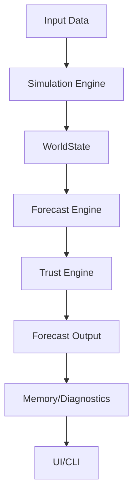

# Pulse

**Version:** v0.2 – Trust Foundations

Pulse is a symbolic-capital foresight simulator that models emotional overlays, strategic fragility, capital exposure forks, and trust-weighted forecast generation.
It's goal is to ingest real-time market, social, political, ecological, etc. data, run monte carlo simulations, state retrodiction, forecast retrodiction, etc. to generate confidence on probabilistic outcomes. 

---

## 🧬 Project Identity

Pulse is a modular simulation intelligence engine designed for recursive forecasting, retrodiction, and capital/narrative strategy synthesis.  
It operates by combining emotional-symbolic overlays, trust scoring, and adaptive rule evolution to generate and validate optimal timelines.  
Memory and trace persistence are core: all simulation cycles are scored, pruned, and iteratively improved.

---


---

## 🚀 Quickstart

    cd pulse
    python main.py

- Outputs 5 forecast cycles by default
- Prints Strategos Digest grouped by trust level
- Saves optional `digest.txt` if logging is enabled

---

## 📂 Module Overview

Pulse/
│
├── core/                  # Central config, registry, and path management
│   ├── __init__.py
│   ├── pulse_config.py   # ✅ Built
│   ├── path_registry.py  # ✅ Built
│
├── simulation_engine/     # Core simulation modules
│   ├── __init__.py
│   ├── worldstate.py     # ✅ Built
│   ├── turn_engine.py    # ✅ Built
│   ├── state_mutation.py # ✅ Built
│   └── rules/
│       ├── __init__.py
│       ├── rule_fingerprint_expander.py # ✅ Built
│       └── reverse_rule_engine.py       # ✅ Built
│
├── forecast_engine/       # Forecasting logic, batch, and export
│   ├── __init__.py
│   ├── forecast_exporter.py # ✅ Built
│   ├── forecast_log_viewer.py # ✅ Built
│   └── ...
│
├── forecast_output/       # Output formatting, digest, and logging
│   ├── __init__.py
│   ├── forecast_licenser.py # ✅ Built
│   ├── pfpa_logger.py      # ✅ Built
│   └── ...
│
├── foresight_architecture/  # Digest, compression, and related tools
│   ├── __init__.py
│   ├── digest_exporter.py   # ✅ Built
│   ├── digest_logger.py     # ✅ Built
│   └── strategos_digest_builder.py # ✅ Built
│
├── memory/                # Forecast memory and audit
│   ├── __init__.py
│   ├── forecast_memory.py        # ✅ Built
│   └── pulse_memory_audit_report.py # ✅ Built
│
├── symbolic_system/       # Symbolic overlays, drift, scoring
│   ├── __init__.py
│   └── symbolic_memory.py # ✅ Built
│
├── capital_engine/        # Capital fork logic
│   ├── __init__.py
│   └── asset_forks.py     # ✅ Built
│
├── diagnostics/           # Self-checks, audits, and stubs
│   ├── __init__.py
│   └── plia_stub.py       # ✅ Built
│
├── operator_interface/    # CLI, UI, dashboards, prompt logger
│   ├── __init__.py
│   ├── pulse_prompt_logger.py # ✅ Built
│   └── strategos_digest.py    # ✅ Built
│
├── utils/                 # Shared utilities
│   ├── __init__.py
│   ├── log_utils.py           # ✅ Built
│   ├── error_utils.py         # ✅ Built
│   └── performance_utils.py   # ✅ Built
│
├── dev_tools/             # Dev scripts, code analysis, migration
│   ├── __init__.py
│   ├── generate_pulse_modules.py # ✅ Built
│   ├── pulse_shell_autohook.py   # ✅ Built
│   ├── pulse_scan_hooks.py       # ✅ Built
│   ├── hook_utils.py             # ✅ Built
│   └── module_dependency_map.py  # ✅ Built
│
├── tests/                 # Unit tests and fixtures
│   ├── __init__.py
│   └── test_forecast_memory.py # ✅ Built
│
├── quarantine/            # Quarantined/legacy files for review
│   └── ...
│
├── docs/                  # Documentation, API reference, deprecation policy
│   └── ...
│
├── main.py                # Main entry point # ✅ Built
├── pulse_ui_shell.py      # UI shell entry point # ✅ Built
├── README.md
├── README.txt
└── .gitignore

---

## 🆕 New Features

- **Rule Fingerprinting:**  
  - See `simulation_engine/rules/reverse_rule_mapper.py` and `rules/rule_fingerprints.json`.
  - CLI: `python simulation_engine/rules/reverse_rule_mapper.py --validate` or `--match key1=val1 key2=val2`
- **Simulation Trace Viewer:**  
  - CLI: `python simulation_engine/utils/simulation_trace_viewer.py <trace.jsonl> [--summary] [--plot] [--plot-var var] [--plot-tags] [--export-summary out.txt]`
- **Memory Audit & Coherence Check:**  
  - Available in UI and interactive shell (`memory-audit`, `coherence-check`).
- **Interactive Shell Help:**  
  - Type `help` for a list of commands and usage.

---

## 🆕 Strategos Digest CLI & Live UI

- **CLI:**  
  Build a digest from compressed forecasts or prompt filter:
  ```
  python -m forecast_output.strategos_digest_builder --from-prompt "AI" --export markdown --output digest.md
  ```
  Use digest templates:
  ```
  python -m forecast_output.strategos_digest_builder --from-prompt "AI" --export markdown --output digest.md --template short
  ```
- **Prompt Log CLI:**  
  View recent prompts:
  ```
  python -m operator_interface.pulse_prompt_logger --recent 5
  python -m operator_interface.pulse_prompt_logger --search "macro"
  python -m operator_interface.pulse_prompt_logger --hash <prompt_hash>
  ```
- **Rule Fingerprint Review CLI:**  
  ```
  python -m simulation_engine.rules.rule_fingerprint_expander --input forecasts.json --min-conf 0.8
  ```
- **Live UI:**  
  Call `live_digest_ui(memory, prompt="AI", n=10, export_fmt="markdown")` to generate and display digest interactively.

---


This is an interpretability-first build: every module is readable, auditable, and designed for modular iteration.

---

## Centralized Configuration

All file paths and key configuration values are now managed in `core/path_registry.py` and `core/pulse_config.py`.  
Modules should import from these files instead of hardcoding paths or constants.

Example:
```python
from core.path_registry import PATHS
from core.pulse_config import CONFIDENCE_THRESHOLD
```

---

## Coding Standards

- Use type annotations and docstrings in all new code.
- Shared logic must go in `utils/`.
- Add/maintain tests for each module in `tests/`.
- Use `@profile` from `utils/performance_utils.py` for performance-critical code.

---

## 🧪 Testing & Profiling

- Unit tests for all modules are in `tests/`.
- Use `pytest` to run tests.
- Example:  
  ```
  pytest tests/test_strategos_digest_builder.py
  pytest tests/test_digest_exporter.py
  pytest tests/test_pulse_prompt_logger.py
  pytest tests/test_reverse_rule_engine.py
  pytest tests/test_rule_fingerprint_expander.py
  ```
- Use `@profile` from `utils/performance_utils.py` for performance-critical code.

---

## How to Contribute

We welcome community contributions! To get started:

1. Fork the repository and create a new branch for your feature or bugfix.
2. Follow the coding standards (type annotations, docstrings, and tests for all new code).
3. Run all tests with `pytest` before submitting a pull request.
4. Ensure your code passes linting (`black` and `flake8` recommended).
5. Submit a pull request with a clear description of your changes.

For larger features, please open an issue first to discuss your proposal.

---

## Architecture Overview

Below is a high-level flowchart of the Pulse system architecture:



- **Input Data:** Ingests real or mock data for simulation.
- **Simulation Engine:** Orchestrates state, overlays, and capital logic.
- **WorldState:** Central state object for each simulation turn.
- **Forecast Engine:** Generates forecasts and symbolic changes.
- **Trust Engine:** Scores, tags, and licenses forecasts.
- **Forecast Output:** Formats, logs, and exports results.
- **Memory/Diagnostics:** Stores history, runs audits, and prunes memory.
- **UI/CLI:** User interface for running and analyzing simulations.

---

## Test Coverage & Running Tests

- All core modules have unit and integration tests in `tests/`.
- Property-based tests (using `hypothesis`) are included for complex logic.
- To run all tests and check coverage:

```sh
pytest --cov=.
```

- To run a specific test file:

```sh
pytest tests/test_forecast_memory.py
```

---

## Coverage Badge

[](https://codecov.io/gh/your-org/pulse)

---

## Deprecation Policy

See `docs/deprecation_policy.md` for the detailed timeline and migration guide for deprecated features.

---

## Deprecation & Milestone Policy

See `docs/deprecation_policy.md`.

---

# Pulse Meta-Learning: DVC & MLflow Experiment Tracking

## DVC Setup
1. Install DVC: `pip install dvc`
2. Initialize: `dvc init`
3. Track pipeline: `dvc repro`

## MLflow Setup
1. Install MLflow: `pip install mlflow`
2. Run tracking example: `python mlflow_tracking_example.py`
3. Start UI: `mlflow ui`

See `dvc.yaml` and `mlflow_tracking_example.py` for details.
