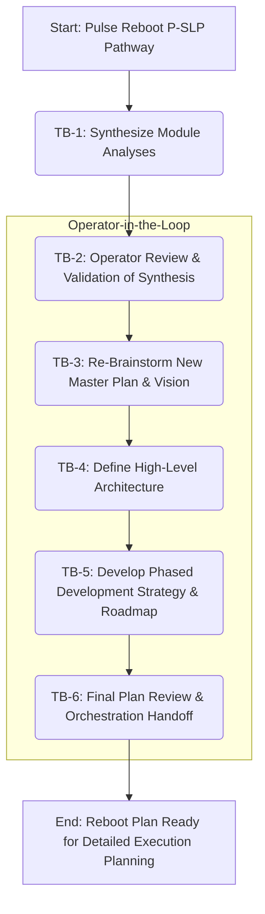

## Plan v1: Pulse Reboot - Synthesis and Re-planning (P-SLP Pathway)

### Objective
To guide the Orchestrator mode in executing the "Synthesize Lessons, Learn, then Formulate New Master Plan" (P-SLP) pathway, as recommended in Think Report v4, for the Pulse project reboot. This involves a thorough analysis of existing module documentation to extract lessons learned, followed by a collaborative re-brainstorming and formulation of a new master plan and development strategy for Pulse, with the operator actively involved at each critical step.

### Task Blocks

| ID    | Description                                                                                                                                                                                             | Owner Mode(s)        | Deliverable(s)                                                                                                                               | Acceptance Test                                                                                                                                                                                                                            | Est. Effort |
| :---- | :------------------------------------------------------------------------------------------------------------------------------------------------------------------------------------------------------ | :------------------- | :------------------------------------------------------------------------------------------------------------------------------------------- | :----------------------------------------------------------------------------------------------------------------------------------------------------------------------------------------------------------------------------------------- | :---------- |
| TB-1  | **Synthesize Existing Module Analyses:** Systematically review all module analysis documents located in `docs/sprint0_module_analysis/`. Extract key findings, identified issues, successful components, architectural patterns (and anti-patterns), and inter-module dependencies. | Architect            | 1. `docs/pulse_reboot_synthesis/lessons_learned_summary.md`: A concise summary of key lessons.   2. `docs/pulse_reboot_synthesis/current_state_synthesis.md`: A comprehensive document detailing the synthesized understanding of the current system. | Operator reviews and approves both documents for completeness, accuracy, and clarity of insights.                                                                                                                                      | High        |
| TB-2  | **Operator Review & Validation (Synthesis):** Present the `lessons_learned_summary.md` and `current_state_synthesis.md` to the operator for detailed review, feedback, and validation. Incorporate any necessary revisions. | Ask (facilitator)    | Revised and operator-approved versions of `lessons_learned_summary.md` and `current_state_synthesis.md`.                                     | Operator explicitly confirms that the synthesis accurately reflects their understanding and captures critical lessons.                                                                                                                       | Medium      |
| TB-3  | **Re-Brainstorm New Pulse Master Plan & Vision:** Based on the validated synthesis (TB-2), facilitate a brainstorming session (with operator) to define a new high-level master plan and vision for Pulse. This should address core objectives, target capabilities, and strategic direction. | Architect, Inspiration | `docs/pulse_reboot_planning/new_master_plan_v1.md`: Document outlining the new vision, key goals, and strategic pillars.                     | Operator reviews and approves the `new_master_plan_v1.md`, confirming alignment with strategic intent.                                                                                                                                     | High        |
| TB-4  | **Define High-Level Architecture & Key Components:** Translate the new master plan (TB-3) into a high-level target architecture. Identify key systems, modules, and their primary interactions. Consider which existing, well-functioning components (identified in TB-1) can be salvaged or adapted. | Architect            | `docs/pulse_reboot_planning/target_architecture_v1.md`: Document describing the proposed high-level architecture and component breakdown. | Operator reviews and approves the `target_architecture_v1.md`, ensuring it logically supports the new master plan.                                                                                                                       | Medium      |
| TB-5  | **Develop Phased Development Strategy & Roadmap:** Based on the target architecture (TB-4), outline a phased development strategy and a high-level roadmap. Prioritize features and define potential milestones.                                                              | Architect            | `docs/pulse_reboot_planning/development_roadmap_v1.md`: Document detailing the phased strategy and roadmap.                                | Operator reviews and approves the `development_roadmap_v1.md`, confirming feasibility and alignment with priorities.                                                                                                                     | Medium      |
| TB-6  | **Final Plan Review & Orchestration Handoff:** Consolidate all approved documents from TB-1 to TB-5 into a final "Pulse Reboot Plan Package." Prepare for handoff to Orchestrator for subsequent detailed planning and execution phases. | Architect            | A consolidated package of all planning documents. A clear summary of the approved reboot plan.                                               | Operator confirms the final reboot plan package is complete and ready for the next stages of detailed design and implementation.                                                                                                               | Low         |

### Flow Diagram

### PCRM Analysis
*   **Pros:**
    *   Maximally leverages existing detailed documentation, saving significant re-analysis effort.
    *   Ensures the new plan is deeply informed by past experiences, successes, and failures.
    *   Strong operator involvement at each stage promotes alignment and buy-in.
    *   Produces a comprehensive set of planning documents to guide future development.
    *   Reduces the risk of repeating past architectural or strategic mistakes.
*   **Cons:**
    *   The synthesis phase (TB-1) can still be time-consuming despite existing documents.
    *   Brainstorming (TB-3) can be challenging and may require multiple iterations to reach consensus.
    *   Success heavily relies on the quality and completeness of the existing module analysis documents.
*   **Risks:**
    *   **Analysis Paralysis:** Getting bogged down in the synthesis phase without moving to actionable planning.
        *   *Mitigation:* Timebox TB-1 and focus on extracting *key* lessons rather than exhaustive re-documentation.
    *   **Incomplete Existing Docs:** The module analyses in `docs/sprint0_module_analysis/` might have gaps or inconsistencies.
        *   *Mitigation:* During TB-1, flag any critical information gaps. If significant, briefly task Ask mode to query the operator for clarification before finalizing the synthesis.
    *   **Scope Creep during Re-brainstorming:** The new vision might become overly ambitious or unfocused.
        *   *Mitigation:* Architect to facilitate TB-3 with clear objectives and constraints derived from the synthesis. Operator to provide grounding.
    *   **Operator Availability:** The plan relies heavily on operator input at multiple stages.
        *   *Mitigation:* Clearly communicate time commitments required from the operator for each review task block.
*   **Mitigations:**
    *   (Covered above within specific risks)
    *   Regular check-ins with the operator throughout each task block, not just at the formal review points.
    *   Use structured templates for deliverables (e.g., for `lessons_learned_summary.md`) to ensure consistency and focus.

### Next Step
This document serves as the detailed plan and prompt for Orchestrator mode.

Reply **Approve** to proceed, or suggest edits.