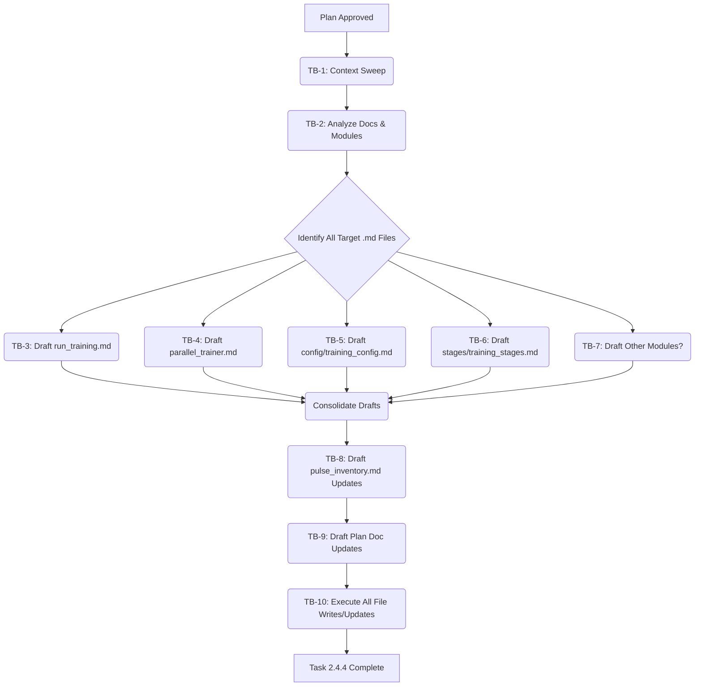

## Plan v1

### Objective
To update and create tandem markdown documentation for all key `recursive_training` modules, update [`docs/pulse_inventory.md`](docs/pulse_inventory.md:0), and update the project planning document ([`docs/planning/pulse_remediation_and_enhancement_plan.md`](docs/planning/pulse_remediation_and_enhancement_plan.md:0)) to reflect completion.

### Task Blocks
These are the steps I will take upon your approval:

| ID    | Description                                                                                                                                  | Owner Mode | Deliverable                                                                                                                                                                 | Acceptance Test                                                                                                                                                                                             |
| :---- | :------------------------------------------------------------------------------------------------------------------------------------------- | :--------- | :-------------------------------------------------------------------------------------------------------------------------------------------------------------------------- | :---------------------------------------------------------------------------------------------------------------------------------------------------------------------------------------------------------- |
| TB-1  | **Context Sweep & Module Identification**                                                                                                      | Architect  | List of existing tandem docs in `docs/recursive_training/`, content of [`docs/pulse_inventory.md`](docs/pulse_inventory.md:0), list of all `.py` files in `recursive_training` and its subdirectories. | Files listed using `list_files`, inventory content retrieved using `read_file`.                                                                                                                             |
| TB-2  | **Read Existing Documentation & Analyze Modules**                                                                                              | Architect  | Understanding of current documentation state and a definitive list of Python modules in `recursive_training` requiring tandem docs.                                           | Key information from existing docs noted. List of target `.md` files confirmed (e.g., `run_training.md`, `parallel_trainer.md`, `config/training_config.md`, `stages/training_stages.md`, and any others). |
| TB-3  | **Draft/Update `docs/recursive_training/run_training.md`**                                                                                     | Architect  | Content for [`docs/recursive_training/run_training.md`](docs/recursive_training/run_training.md:0) drafted based on module code, docstrings, and examples.                               | Markdown content ready for `write_to_file`, adhering to specified content structure (Purpose, Key Components, Workflow, Usage, Relationships).                                                              |
| TB-4  | **Draft/Update `docs/recursive_training/parallel_trainer.md`**                                                                                 | Architect  | Content for [`docs/recursive_training/parallel_trainer.md`](docs/recursive_training/parallel_trainer.md:0) drafted.                                                                       | Markdown content ready for `write_to_file`.                                                                                                                                                                 |
| TB-5  | **Draft/Update `docs/recursive_training/config/training_config.md`**                                                                           | Architect  | Content for [`docs/recursive_training/config/training_config.md`](docs/recursive_training/config/training_config.md:0) drafted.                                                              | Markdown content ready for `write_to_file`, including Configuration details. Directory `docs/recursive_training/config/` will be created if not present.                                                  |
| TB-6  | **Draft/Update `docs/recursive_training/stages/training_stages.md`**                                                                           | Architect  | Content for [`docs/recursive_training/stages/training_stages.md`](docs/recursive_training/stages/training_stages.md:0) drafted.                                                              | Markdown content ready for `write_to_file`, including Workflow details. Directory `docs/recursive_training/stages/` will be created if not present.                                                       |
| TB-7  | **Identify & Draft Docs for Other Significant `recursive_training` Modules (if any)**                                                          | Architect  | Analysis of other modules in `recursive_training` (e.g., utils) and draft documentation if they meet criteria for tandem docs.                                                 | Decision made on other modules; additional tandem docs drafted if necessary.                                                                                                                                |
| TB-8  | **Draft Updates for `docs/pulse_inventory.md`**                                                                                                | Architect  | Changes for [`docs/pulse_inventory.md`](docs/pulse_inventory.md:0) drafted to reflect new/updated `recursive_training` documentation.                                               | Diff content ready for `apply_diff` or full content for `write_to_file`.                                                                                                                                    |
| TB-9  | **Draft Updates for `docs/planning/pulse_remediation_and_enhancement_plan.md`**                                                                | Architect  | Changes for [`docs/planning/pulse_remediation_and_enhancement_plan.md`](docs/planning/pulse_remediation_and_enhancement_plan.md:0) drafted to mark Task 2.4.4 complete.             | Diff content ready for `apply_diff`.                                                                                                                                                                        |
| TB-10 | **Execute File Writes/Updates**                                                                                                                | Architect  | All drafted markdown files, inventory, and planning document updates are written to the filesystem.                                                                         | `write_to_file` and/or `apply_diff` tool calls made for all drafted content. User confirms success of writes.                                                                                               |

### Flow Diagram (Execution after approval)

### PCRM Analysis
*   **Pros:**
    *   Comprehensive and up-to-date documentation improves maintainability, developer onboarding, and overall understanding of the `recursive_training` module.
    *   A centralized and accurate [`docs/pulse_inventory.md`](docs/pulse_inventory.md:0) aids project navigation and component discovery.
    *   Clear documentation supports future development and refactoring efforts.
*   **Cons:**
    *   Creating detailed documentation can be time-consuming, requiring careful review of module code and functionality.
    *   Ensuring consistency across multiple new/updated markdown files requires attention to detail.
*   **Risks:**
    *   **Documentation Staleness:** Documentation might become outdated if subsequent code changes are not accompanied by corresponding doc updates.
        *   *Mitigation:* Reinforce the existing process of updating tandem docs alongside code changes (as per global instructions).
    *   **Incomplete Coverage:** Some significant public interfaces or utility modules within `recursive_training` might be overlooked.
        *   *Mitigation:* TB-1 includes a thorough listing of all files in the `recursive_training` directory and its subdirectories to identify all potential candidates for documentation. TB-7 is dedicated to this.
    *   **Inconsistent Detail/Style:** Tandem documents might vary in quality or style.
        *   *Mitigation:* Adherence to the user-provided content guidelines (Purpose, Key Components, etc.) for each markdown file.
*   **Mitigations:** (Covered above)