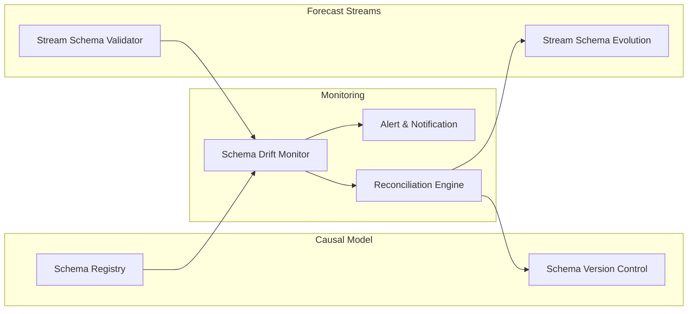
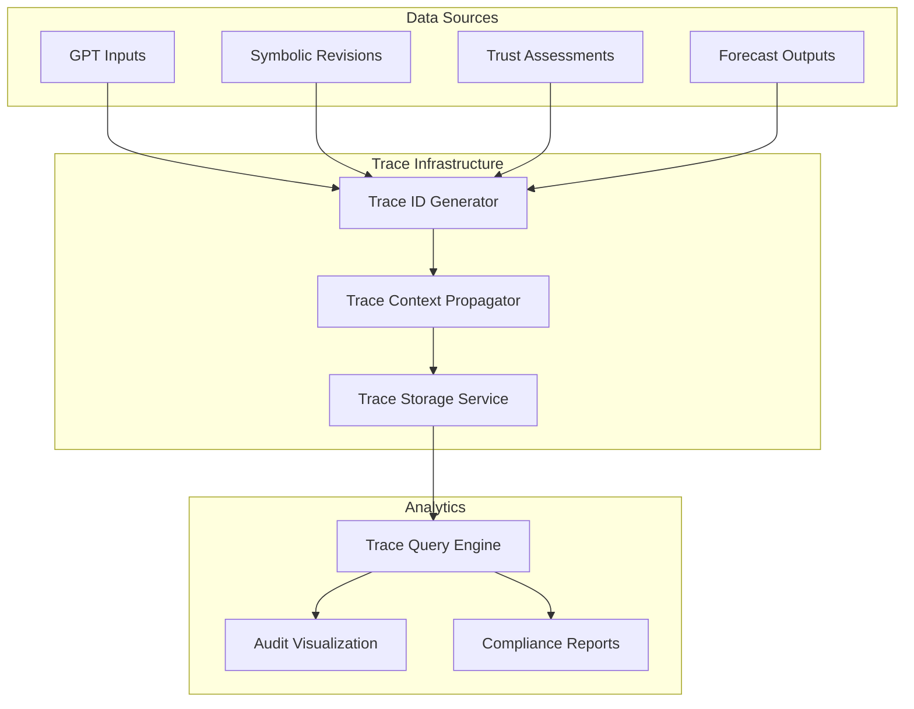
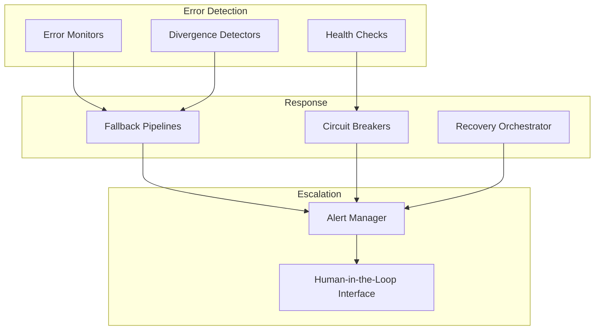
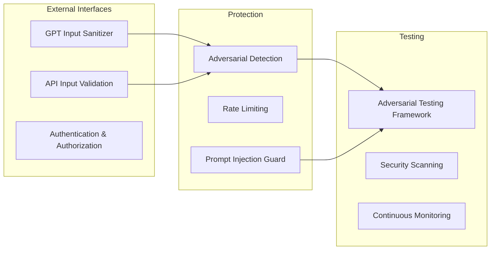
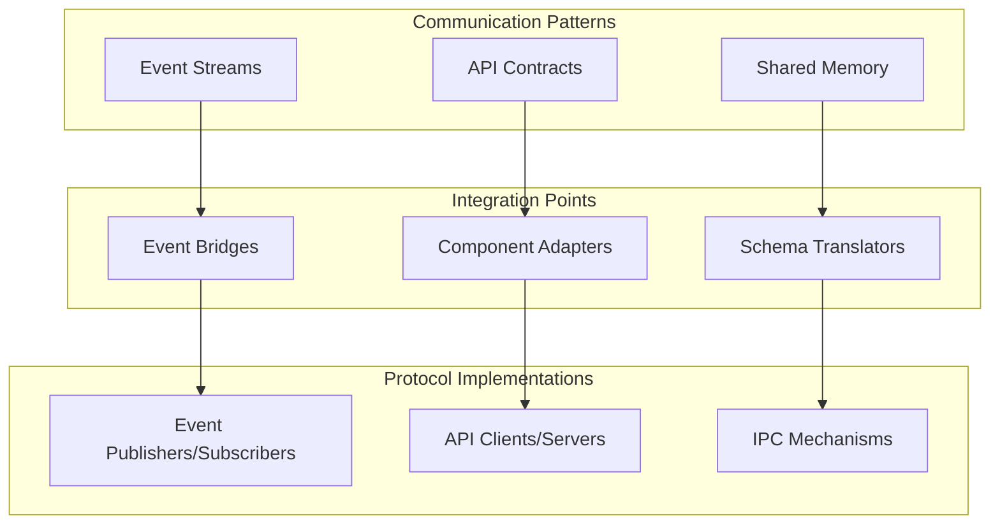

# AI Training Layer Architecture

```mermaid
flowchart TB
  subgraph Ingestion & Storage
    A[Iris Data Ingestion] --> B[(Raw Data Store)]
    C[Forecast Output\n(PFPA archive)] --> B
    D[Retrodiction Results\n(trust_system)] --> B
  end

  subgraph Preprocessing & Feature Engineering
    B --> E[Preprocessor\n– normalization, blending live/retrodiction]
    E --> F[Feature Store]
  end

  subgraph Training Orchestration
    F --> G[Orchestration Engine\n– schedules experiments & fine-tuning jobs]
    G --> H[Model Manager]
  end

  subgraph Model Management
    H --> I[Model Registry\n(versions, metadata, metrics)]
    I --> J[Deployment & Serving API]
  end

  subgraph Evaluation & Feedback
    I --> K[Evaluation Engine\n– runs benchmarks vs. Pulse outputs]
    F --> K
    K --> L[Metric Store\n(retrodiction error, symbolic alignment, trust delta)]
    L --> G
    L --> M[Rule Generator]
  end

  subgraph Rule Generation & Pruning
    M[Rule Generator\n– GPT & symbolic_system] --> N[Rule Evaluator\n– simulation + retrodiction test]
    N --> O[Rule Repository]
    O --> P[Pruner\n– discard low-performers via thresholds]
    P --> M
  end
```

## 1. Core Modules

- **Iris Data Ingestion**  
  - Plugins for APIs, Kafka, S3, etc. → Raw data store  
  - *Frequency constraint*: Ingest variables at most once per day (weekly time series) unless a new variable is detected.

- **Forecast & Retrodiction Collector**  
  - PFPA logger, `trust_system.retrodiction_engine` → persistence layer

- **Preprocessor & Feature Store**  
  - Blends live forecasts + retrodictions, normalizes overlays, computes derived signals

- **Training Orchestration**  
  - Job scheduler (Airflow/DAG), experiment runner for fine-tuning & RL training

- **Model Manager & Registry**  
  - Version control (MLflow/DVC), metadata, artifact storage

- **Evaluation Engine**  
  - Benchmarks model outputs vs. Pulse simulation via `simulate_forward`  
  - Metrics: MAE retrodiction error, symbolic alignment score, trust/regret delta

- **Rule Generator & Pruner**  
  - GPT-based fingerprint & rule extraction  
  - Symbolic revision planner  
  - Rule mutation engine and evaluation  
  - Pruner applies retention policies based on performance

## 2. End-to-End Data Flow

1. Iris ingestion → raw snapshots & signals  
2. Pulse forecasts → PFPA archive  
3. Retrodiction via `trust_system.retrodiction_engine` → retrodiction memory  
4. Preprocessor merges data, computes features  
5. Orchestrator pipelines features into training jobs (OpenAI fine-tune & open-source)  
6. Evaluation engine scores new models  
7. Metrics feed back into orchestrator and rule generator

## 3. Integration Points

- `forecast_engine.ai_forecaster` & `forecast_output/pfpa_logger`  
- `trust_system.retrodiction_engine` & `simulation_engine.simulator_core`  
- `learning.compute_retrodiction_error` & `learning.retrodiction_curriculum`  
- GPT training hooks in `intelligence/function_router` ("train-gpt")

## 4. Training & Evaluation Loop

- **APIs**: OpenAI Python SDK, Hugging Face Transformers, Ray RLlib  
- **Metrics**:  
  - Retrodiction MAE (`compute_retrodiction_error`)  
  - Symbolic alignment score (`symbolic_trace_scorer`)  
  - Trust/regret delta  
- **Feedback**: Retraining on drift, rule upgrades, pruning stale rules

## 5. Dynamic Rule Generation & Pruning

1. Propose rules (GPT + symbolic planner)  
2. Batch evaluate in `simulation_engine.rule_mutation_engine`  
3. Store in Rule Repository  
4. Pruner discards rules below impact threshold

## 6. Recommended Frameworks & Tools

- Hugging Face Transformers & Datasets  
- LangChain for LLM orchestration  
- Ray RLlib or Stable-Baselines3 for RL  
- MLflow or DVC for model registry  
- Weights & Biases for experiment tracking  
- OpenAI Python SDK for prototyping  
- Airflow for scheduling

<!-- NEW SECTION -->
## 7. Schema Drift Detection and Reconciliation



- **Schema Registry & Version Control**
  - `causal_model/schema_registry.py`: Central repository for all data schemas
  - Version-controlled schema definitions for causal model variables and forecast outputs
  - Strict validation against registered schemas during model training and inference

- **Drift Detection Mechanisms**
  - `forecast_engine/schema_drift_monitor.py`: Automated monitoring for schema inconsistencies
  - Implements statistical tests to detect subtle shifts in variable distributions
  - Periodically validates causal model inputs/outputs against forecast stream schemas

- **Reconciliation Process**
  - Automated detection logs all schema inconsistencies to `logs/schema_drift.log`
  - Alert system for critical schema mismatches via the operator interface
  - `forecast_engine/schema_reconciliation.py`: Implements schema migration helpers
  - Backward compatibility layer for handling schema evolution

- **Current Limitations**
  - Schema drift detection is reactive rather than predictive
  - Manual intervention required for complex schema reconciliation scenarios
  - Future work: implement predictive drift detection using ML techniques

## 8. System-Wide Traceability and Audit Logging



- **End-to-End Decision Flow Tracing**
  - `core/trace_context.py`: Implements distributed tracing across all modules
  - Unique trace IDs propagated from GPT inputs through all processing stages to forecast outputs
  - Full parent-child relationship tracking for complex decision chains

- **Comprehensive Audit Logging**
  - `core/audit_logger.py`: Standardized audit logging across all critical components
  - Structured log format capturing user, action, timestamp, input/output data, and trace IDs
  - Tamper-evident logging with cryptographic verification for compliance scenarios

- **Trace Analysis and Visualization**
  - `visualization/trace_explorer.py`: Interactive visualization of decision flows
  - Query interface for filtering/searching traces by module, time range, or specific inputs
  - Exportable audit trails for regulatory compliance or post-incident analysis

- **Implementation Status**
  - Core tracing infrastructure implemented in main processing paths
  - Incomplete coverage in peripheral modules and external integrations
  - Ongoing work to extend tracing to all system boundaries

## 9. Error Handling and Resilience Mechanisms



- **Layered Error Detection**
  - `forecast_engine/error_monitor.py`: Continuous monitoring of all forecast processing stages
  - `forecast_engine/forecast_divergence_detector.py`: Statistical detection of severe forecast anomalies
  - Regular health checks verify component availability and response times

- **Automated Recovery Mechanisms**
  - `forecast_engine/fallback_pipeline.py`: Alternative forecast generation paths for different failure scenarios
  - Circuit breakers prevent cascading failures by isolating problematic components
  - Retry policies with exponential backoff for transient errors

- **Human-in-the-Loop Escalation**
  - Severity-based alert routing to the appropriate personnel
  - `operator_interface/error_intervention.py`: Interface for human validation of automated recovery actions
  - Supervised recovery workflows for critical system components

- **Specific Resilience Features**
  - Automatic fallback to previous forecast versions when new forecasts show extreme divergence
  - Shadow-mode testing of new components alongside production versions
  - Progressive deployment of AI model updates with automated rollback capabilities
  - Detailed error telemetry for root cause analysis and system improvement

## 10. Security and Adversarial Robustness



- **External Interface Hardening**
  - `GPT/prompt_sanitizer.py`: Comprehensive input sanitization for all LLM interactions
  - Strong input validation for all API endpoints with schema-based verification
  - Role-based access control for all system interfaces

- **Adversarial Protection Mechanisms**
  - `GPT/prompt_injection_detector.py`: ML-based detection of potential prompt injection attacks
  - Rate limiting and pattern detection to prevent abuse of GPT endpoints
  - Sandboxed execution environments for user-influenced processing

- **Security Testing and Validation**
  - `dev_tools/adversarial_test_suite.py`: Comprehensive suite of adversarial tests
  - Regular security scanning of dependencies and generated code
  - Red team exercises to identify potential vulnerabilities in LLM interactions

- **Current Security Posture**
  - GPT interfaces implement basic prompt sanitization and validation
  - Advanced adversarial testing and protection mechanisms remain in development
  - High-priority roadmap item: Comprehensive adversarial robustness evaluation for all external interfaces

## 11. Technical Integration Mechanisms



- **Core Integration Patterns**
  - **Event-Based Communication**: 
    - `core/event_bus.py`: Central event distribution system
    - Publisher-subscriber pattern for loose coupling between components
    - Events serialized with Protocol Buffers for efficiency and type safety
  
  - **API-Based Integration**:
    - `interfaces/api_registry.py`: Central registry of all component APIs
    - RESTful and gRPC interfaces for synchronous interactions
    - OpenAPI/Swagger specifications for all interfaces
  
  - **Shared Data Structures**:
    - `core/shared_memory.py`: Memory-mapped data structures for high-performance inter-process communication
    - Versioned data schemas with backward compatibility
    - Read/write locks for concurrent access management

- **Component Adapter Layer**
  - `adapters/`: Directory containing adapter implementations for all major components
  - `adapters/gpt_adapter.py`: Standardized interface to GPT components
  - `adapters/symbolic_adapter.py`: Interface to symbolic reasoning system
  - `adapters/forecast_adapter.py`: Unified access to forecasting components

- **Integration Protocols**
  - Internal communication uses Protocol Buffers over ZeroMQ for efficiency
  - Cross-process communication uses memory-mapped files for large data transfers
  - External APIs implement standard REST with JSON for accessibility
  - Async workflows use Kafka-based event streams for reliability

- **Configuration and Discovery**
  - `core/service_discovery.py`: Dynamic service registration and discovery
  - Configuration-driven integration with dependency injection
  - Health checking and circuit breaking for resilient integration

---