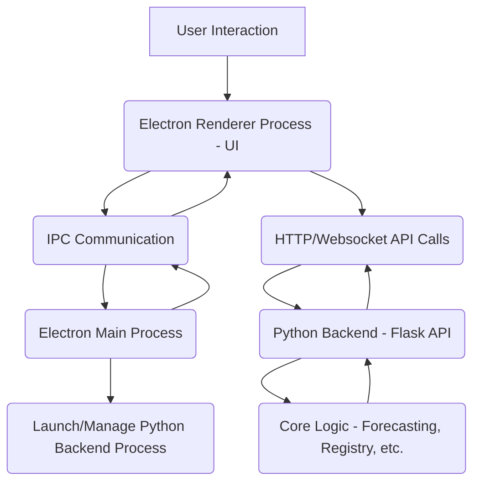

# Pulse Desktop Application Plan: Electron Approach

This document outlines the detailed plan for developing a desktop application for Pulse using the Electron framework, integrating the existing Python backend logic.

## Feasibility Analysis Summary:

*   **Backend Integration:** The modular Python backend and existing Flask API provide a good foundation for integration.
*   **UI Development:** Requires significant effort to adapt or rewrite the web UI for a desktop experience.
*   **Framework Choice:** Electron allows leveraging web technologies and skills, with integration via API communication.

## Detailed Plan: Electron Approach

1.  **Project Setup and Structure:**
    *   Initialize a new Electron project (`package.json`, main process entry, configuration).
    *   Establish a clear directory structure for Electron main process, renderer process (UI), and Python backend code.
    *   Configure build tools (e.g., Webpack, Parcel) for the renderer process if using a framework like React.

2.  **Electron Main Process Development:**
    *   Create the main Electron script (`main.js` or similar) for window management, application lifecycle, and Python backend process management.
    *   Implement Inter-Process Communication (IPC) channels between the main and renderer processes for accessing Node.js/Electron APIs and interacting with the backend process.

3.  **UI Development (Renderer Process):**
    *   Decide on migrating existing React components or rewriting the UI using React or another framework within the Electron renderer process. Adaptation for a desktop feel is likely necessary.
    *   Implement the different views/pages (Dashboard, Forecasting, Retrodiction, Variables, etc.).
    *   Utilize Electron's native desktop features (menus, notifications) as needed.

4.  **Python Backend Integration (API Communication):**
    *   Determine backend execution method (e.g., child process managed by Electron).
    *   Maintain or adapt the existing Flask API (`api.py`) for local communication.
    *   Implement API calls from the Electron app (renderer or main process) to the local Python backend.
    *   Handle API responses and errors in the UI.

5.  **Packaging and Distribution:**
    *   Use Electron-builder or Electron-packager for cross-platform packaging.
    *   Include the Python backend and dependencies (e.g., using `venv` + PyInstaller) in the package.
    *   Configure Electron to launch and manage the packaged Python backend.

## Architectural Flow (Electron with API):

## Key Considerations:

*   **State Management:** How to manage application state across processes and sync with the backend.
*   **Error Handling:** Implement robust error handling.
*   **Performance:** Optimize frontend and backend performance.
*   **Security:** Ensure secure local communication.
*   **Updates:** Plan for application updates.